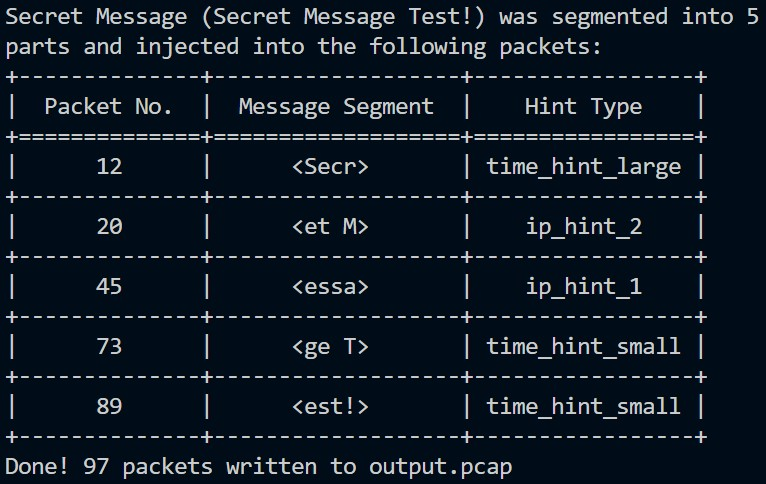
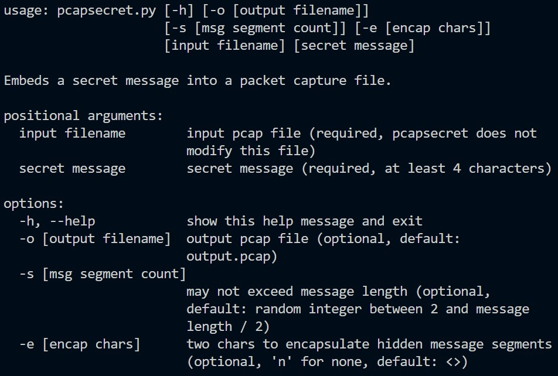

# pcapsecret v0.1

Pcapsecret injects a secret message into a packet capture (pcap) file.  Students use Wireshark or a similar tool to: 1) inspect an output.pcap file to find the malformed packets, and 2) reconstruct the secret message by combining the last bytes of each sequential malformed packet.

## Description

I made pcapsecret as a game for students in my Comp. Sci. class (but also for fun and to help me learn about [scapy](https://scapy.readthedocs.io/en/latest/index.html)!)  Here's what it does:

* Reads packets from input pcap file and extracts basic data (with scapy's pipetools);
   * Does not modify input pcap file.
* Segments secret message and encapsulates message segments with encap chars (default encap chars: <>);
* Injects message segments as payloads in random sequential packets; 
    * Payloads containing message segments are <b>appended to the last bytes of each chosen packet</b>.
* Provides <br>hints by malforming or modifying packets which contain message segments</b>;
* Saves packets to output.pcap; and
* Prints answer key table to console.
* Hint Types (To Do: add hint types):
    * no_hint (disabled) = add segment as payload, reset size on wire = captured size (difficult to detect).      
    * time_hint_small = time changed to outside range of time of pkts +2 or -2 indices away, causing packet to appear out of place. 
    * time_hint_large = significant time change (index hint as time_hint_small).
    * length_hint = malformed packet length due to size on wire != captured size.
    * addr_hint_1 = MAC and/or IP source and destination are random, not in input pcap file.
    * addr_hint_2 = Ethernet layer contains broadcast mac address in source and destination.
* For fun, try using a shortened url as the secret message.

## Getting Started

### Cloning and Environment Setup
* Linux:
```
git clone https://github.com/FrozenBurrito/pcapsecret.git
cd pcapsecret
python -m venv .
source bin/activate
pip install -r requirements.txt
```
* Windows:\
First, download and install the [NMap Project's packet capture library for Windows](https://npcap.com/).
```
git clone https://github.com/FrozenBurrito/pcapsecret.git
cd pcapsecret
python -m venv .
scripts\activate.bat 
pip install -r requirements.txt
```

### Running pcapsecret
```
python pcapsecret.py input.pcap "Secret Message Test!"
```


### Usage
```
python pcapsecret.py --help
```


## Help

Let me know if you have any questions or suggestions!

## Authors

Jon Morris, [frozenburrito](https://github.com/frozenburrito)

## Version History
* 0.1
    * It works!

## License

This project is licensed under the MIT License.  See the LICENSE.md file for details.

## Helpful Libraries

* [scapy](https://scapy.readthedocs.io/en/latest/index.html)
* [tabulate](https://pypi.org/project/tabulate/)

## Helpful Sources

* [NMap Project's packet capture library for Windows](https://npcap.com/)
* [pylint issues with scapy in VS Code](https://stackoverflow.com/questions/51852412/vscode-import-error-from-scapy-all-import-ip)
